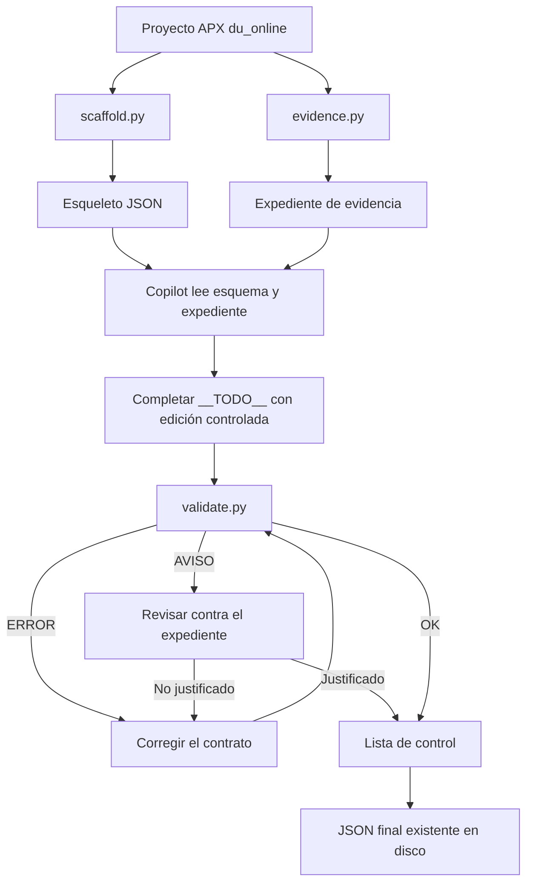
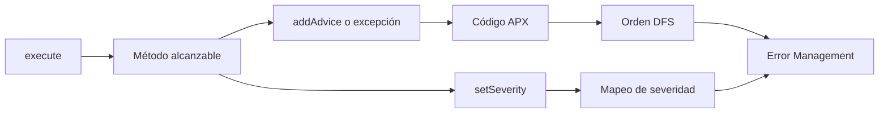

# Skill `recolectar-contrato-apx`

## Propósito

Generar un contrato JSON de una transacción APX `du_online` a partir del XML, POM, código Java, DTOs, librerías y configuración del proyecto. El resultado debe ser determinista, trazable y compatible con el esquema canónico.

La skill separa tres responsabilidades:

| Responsable | Función |
|---|---|
| Scripts | Descubrir inventario, construir evidencia y comprobar invariantes |
| Copilot | Leer la evidencia, confirmar el flujo y redactar descripciones |
| Validador | Detectar contradicciones entre JSON, XML y código |

Copilot no debe inventar significado funcional. Cuando las fuentes no permiten una conclusión, debe usar `NO HAY INFORMACIÓN SUFICIENTE`.

## Fuentes y responsabilidades

- `references/contrato-transaccion.json`: estructura exacta del contrato.
- `../../prompts/recolectar-contrato-apx-tipo-a.prompt.md`: norma de análisis y precedencia de fuentes.
- `references/reglas-redaccion.md`: reglas para describir parámetros, librerías, flujo y errores.
- `references/lista-control.md`: comprobaciones finales de calidad.
- `scripts/`: herramientas deterministas de descubrimiento y validación.
- `../../agents/recolector-contrato-apx.agent.md`: modo de trabajo de Copilot y formato de respuesta.

## Flujo completo



## Procedimiento de Copilot

Para cada transacción:

1. Confirmar la raíz del proyecto y el ID de la transacción.
2. Ejecutar `scaffold.py` para crear el inventario canónico.
3. Ejecutar `evidence.py` y leer el expediente completo.
4. Revisar directamente el código si el grafo estático no sigue un helper, una implementación o una rama necesaria.
5. Completar únicamente los campos `__TODO__` siguiendo `reglas-redaccion.md`.
6. Ejecutar `validate.py`.
7. Resolver los `ERROR` y revisar todos los `AVISO`.
8. Repetir la validación hasta obtener `RESULTADO <ID>: OK`.
9. Comprobar que el archivo existe y recorrer la lista de control.

No se debe modificar el proyecto APX analizado. Solo se escribe en la carpeta de salida.

## Scripts

### `scaffold.py` - inventario y esqueleto

```text
python ./scripts/scaffold.py <raiz> <ID> <salida>/<ID>.json
```

Lee el XML, el POM y la clase concreta. Genera los parámetros en el orden canónico, sus tipos, obligatoriedad, metadatos y librerías detectadas. Deja `__TODO__:<ruta>` donde hace falta análisis humano.

Copilot no debe rehacer manualmente nombres, orden, tipos, obligatoriedad ni librerías.

### `evidence.py` - expediente verificable

```text
python ./scripts/evidence.py <raiz> <ID> --out <salida>/_evidencia/<ID>.txt
```

Genera un expediente numerado con:

- clase concreta y setters de salida;
- firmas y Javadocs de librerías;
- grafo estático desde `execute()`;
- cuerpos de métodos alcanzables;
- orden DFS de emisiones de error;
- severidades, properties y marcadores explícitos;
- accesos a campos de parámetros;
- getters, setters e inicializadores no triviales de DTOs.

El expediente es evidencia para leer, no el contrato final.

#### Secciones del expediente

El archivo `.txt` generado por `evidence.py` se organiza así:

1. **Clase concreta:** muestra la transacción principal completa y permite revisar `execute()` y sus asignaciones.
2. **Clase abstracta y salidas (`1b`):** muestra los `addParameter` de salida y si existe una guarda antes de asignarlos.
3. **Librerías invocadas:** muestra la interfaz, el método llamado y su Javadoc cuando está disponible.
4. **Grafo de llamadas:** enumera los métodos alcanzables desde `execute()` y las emisiones de errores encontradas.
5. **Secuencia DFS de primera emisión:** lista los códigos de error en el orden obligatorio para `Error Management`, junto con condiciones, descripciones candidatas y severidades.
6. **Properties y marcadores:** muestra textos de recursos y evidencias explícitas de asincronía o transaccionalidad.
7. **Accesos por campo:** indica dónde se leen, escriben o construyen los parámetros de entrada y salida.
8. **DTOs:** muestra inicializadores y getters/setters no triviales que pueden transformar los valores.

### `callgraph.py` - grafo estático

Es un componente interno usado por `evidence.py` y `validate.py`. Sigue tipos declarados, llamadas estáticas, `this`, `super`, `Clase::metodo` y librerías obtenidas con `getServiceLibrary`.

Su salida determina el orden DFS de `Error Management`. No evalúa condiciones de ejecución: considera las ramas alcanzables salvo que el código demuestre que una condición es constante y falsa.

### `apx_common.py` - utilidades compartidas

Es un componente interno. Centraliza lectura de XML y Java, expansión de parámetros, conversión de tipos APX, resolución de constantes, detección de librerías, marcadores y carga estricta de JSON.

No se ejecuta como fase independiente.

### `validate.py` - comprobación final

```text
python ./scripts/validate.py <raiz> <salida>/<ID>.json
```

Comprueba forma JSON, parámetros contra XML, librerías invocadas, errores alcanzables, severidades, referencias a código, flujo, marcadores y accesores no triviales.

- `ERROR`: bloquea la entrega y debe corregirse.
- `AVISO`: debe contrastarse con el expediente y justificarse o corregirse.
- `RESULTADO <ID>: OK`: permite pasar a la lista de control.

## Flujo de errores



La sección `5. Secuencia DFS de primera emisión` del expediente determina el orden obligatorio de los códigos. Las descripciones de error deben conservar el texto literal o la candidata normalizada que muestra la evidencia.

## Límites conocidos

El análisis es léxico. Puede no resolver lambdas complejas, reflexión, despacho dinámico con varias implementaciones o métodos que no estén disponibles en el código fuente. En esos casos Copilot debe abrir el código cercano, documentar la incertidumbre y no atribuir comportamientos no demostrados.

## Criterio de entrega

La salida válida es un `<ID>.json` que conserva exactamente el esquema y cuya última validación muestra:

```text
RESULTADO <ID>: OK
```